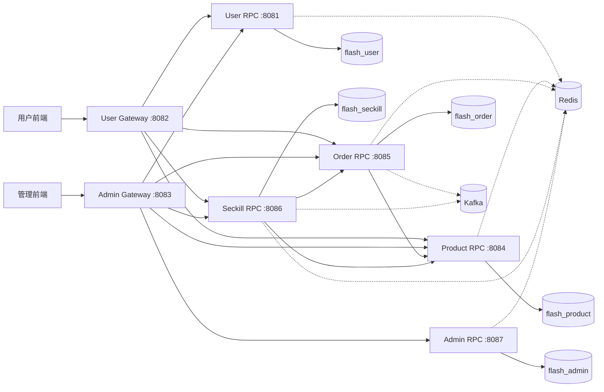

# 系统与代码总览

## 1. 架构目标

FlashSale 当前后端采用“**双网关 + 多 RPC 微服务 + 共享基础能力库**”架构：

- 用户流量统一进入 `apps/gateway/user`
- 管理流量统一进入 `apps/gateway/admin`
- 业务能力由 `user/product/order/seckill/admin` 五个 RPC 提供
- 公共能力统一沉淀在 `pkg/base/*`
- 运维与测试入口统一通过 `cmd/fs`

## 2. 运行时架构图

## 3. 代码分层模型

## 4. 模块关系（业务视角）

- `user`：用户注册、登录、资料维护；为下单/秒杀提供主体。
- `product`：商品主数据、库存管理；为订单与秒杀提供库存接口。
- `order`：交易主线（创建、支付确认、审核、发货、收货、关闭）；可接收秒杀建单。
- `seckill`：活动化秒杀流程（活动、活动商品、抢购、埋点、活动订单追溯）。
- `admin`：管理员认证、RBAC、数据范围与审计。
- `gateway`：HTTP 协议适配、鉴权、限流、参数前置校验、RPC 转发。

## 5. 关键工程约束

- 金额统一 `int64` 分（`*_cent`）。
- ID 使用雪花 ID（HTTP 层允许 `number|string` 兼容解析）。
- 错误码统一由 `pkg/base/errorx` 定义，gRPC 映射由 `pkg/base/grpcerr` 维护。
- 管理端权限采用 `domain + data_scope(all/self)` 双维约束。
- 秒杀链路采用“Redis 热路径 + MySQL 追溯 + Kafka 事件”模式。
