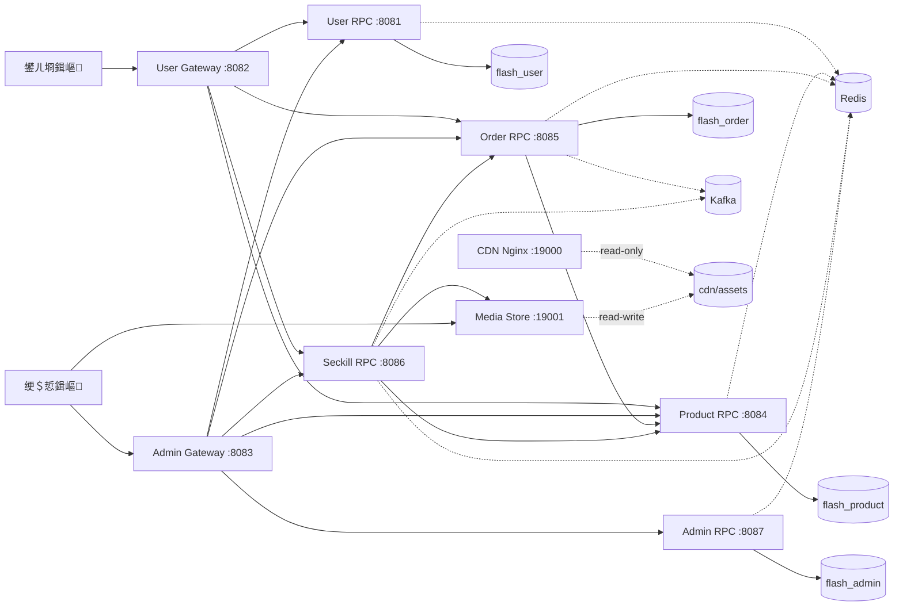
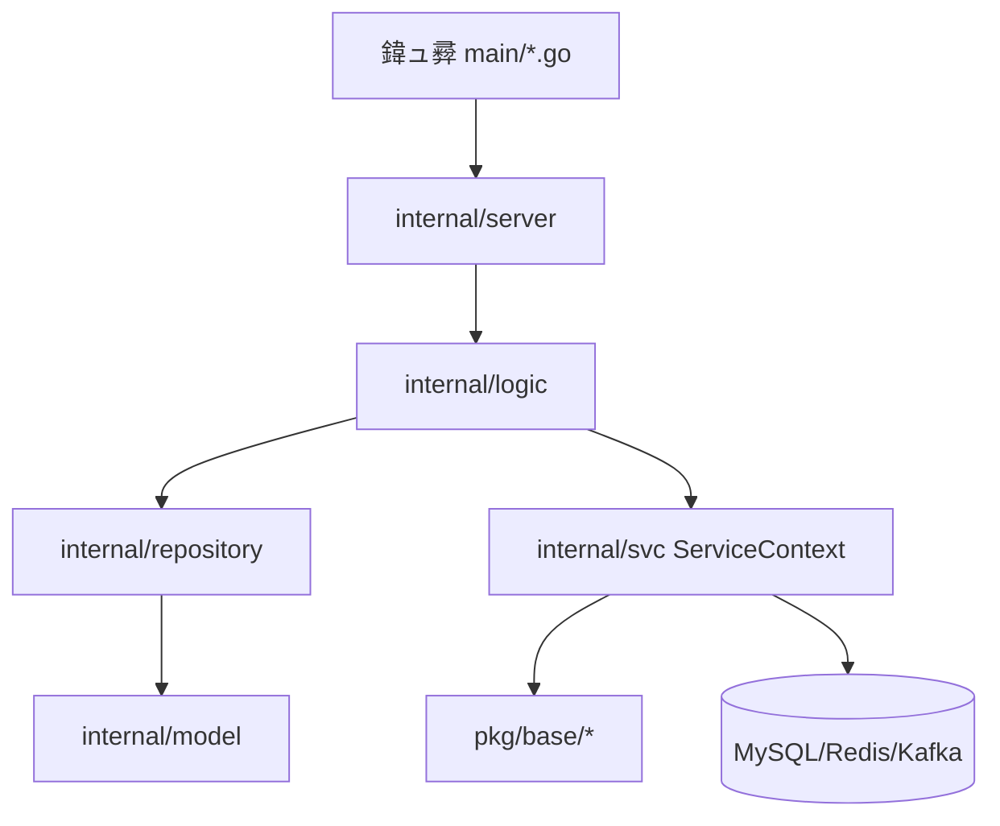

# 绯荤粺涓庝唬鐮佹€昏

## 1. 鏋舵瀯鐩爣

FlashSale 褰撳墠鍚庣閲囩敤鈥?*鍙岀綉鍏?+ 澶?RPC 寰湇鍔?+ 鍏变韩鍩虹鑳藉姏搴?*鈥濇灦鏋勶細

- 鐢ㄦ埛娴侀噺缁熶竴杩涘叆 `apps/gateway/user`
- 绠＄悊娴侀噺缁熶竴杩涘叆 `apps/gateway/admin`
- 涓氬姟鑳藉姏鐢?`user/product/order/seckill/admin` 浜斾釜 RPC 鎻愪緵
- 鍏叡鑳藉姏缁熶竴娌夋穩鍦?`pkg/base/*`
- 杩愮淮涓庢祴璇曞叆鍙ｇ粺涓€閫氳繃 `ops/cmd`

## 2. 杩愯鏃舵灦鏋勫浘

## 3. 浠ｇ爜鍒嗗眰妯″瀷

## 4. 妯″潡鍏崇郴锛堜笟鍔¤瑙掞級

- `user`锛氱敤鎴锋敞鍐屻€佺櫥褰曘€佽祫鏂欑淮鎶わ紱涓轰笅鍗?绉掓潃鎻愪緵涓讳綋銆?- `product`锛氬晢鍝佷富鏁版嵁銆佸簱瀛樼鐞嗭紱涓鸿鍗曚笌绉掓潃鎻愪緵搴撳瓨鎺ュ彛銆?- `order`锛氫氦鏄撲富绾匡紙鍒涘缓銆佹敮浠樼‘璁ゃ€佸鏍搞€佸彂璐с€佹敹璐с€佸叧闂級锛涘彲鎺ユ敹绉掓潃寤哄崟銆?- `seckill`锛氭椿鍔ㄥ寲绉掓潃娴佺▼锛堟椿鍔ㄣ€佹椿鍔ㄥ晢鍝併€佹姠璐€佸煁鐐广€佹椿鍔ㄨ鍗曡拷婧級銆?- `admin`锛氱鐞嗗憳璁よ瘉銆丷BAC銆佹暟鎹寖鍥翠笌瀹¤銆?- `gateway`锛欻TTP 鍗忚閫傞厤銆侀壌鏉冦€侀檺娴併€佸弬鏁板墠缃牎楠屻€丷PC 杞彂銆?- `cdn`锛歂ginx 鍙闈欐€佹枃浠舵湇鍔★紙鍟嗗搧涓诲浘銆佹í骞呯瓑绱犳潗锛夈€?- `media-store`锛氭枃浠剁鐞嗘湇鍔★紙涓婁紶/鍒犻櫎/鍒楄〃锛夛紝涓?CDN 鍏变韩 volume銆?
## 5. 鍏抽敭宸ョ▼绾︽潫

- 閲戦缁熶竴 `int64` 鍒嗭紙`*_cent`锛夈€?- ID 浣跨敤闆姳 ID锛圚TTP 灞傚厑璁?`number|string` 鍏煎瑙ｆ瀽锛夈€?- 閿欒鐮佺粺涓€鐢?`pkg/base/errorx` 瀹氫箟锛実RPC 鏄犲皠鐢?`pkg/base/grpcerr` 缁存姢銆?- 绠＄悊绔潈闄愰噰鐢?`domain + data_scope(all/self)` 鍙岀淮绾︽潫銆?- 绉掓潃閾捐矾閲囩敤鈥淩edis 鐑矾寰?+ MySQL 杩芥函 + Kafka 浜嬩欢鈥濇ā寮忋€?

