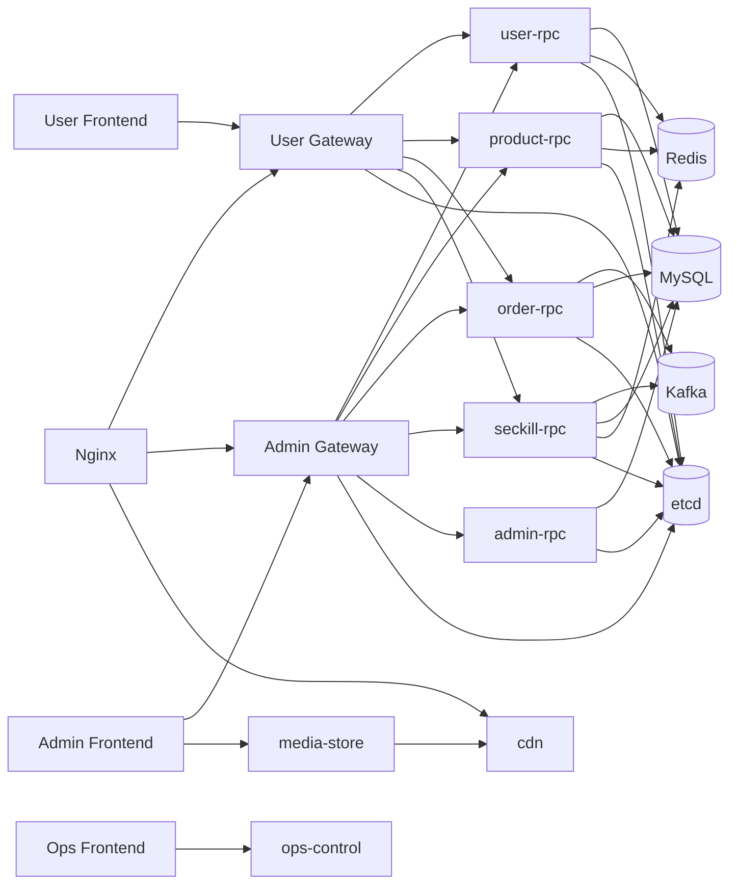

# 总体架构

## 1. 结构总览

## 2. 分层说明

### 前端层

- `frontend/user`：用户侧购物和秒杀交互。
- `frontend/admin`：商品、订单、活动、管理员的后台管理界面。
- `frontend/ops`：项目专用运维面板。

### 接入层

- `user-gateway`：用户侧 HTTP API 入口。
- `admin-gateway`：管理侧 HTTP API 入口。
- `nginx`：统一入口和代理层。

### 业务层

- `user-rpc`：用户账号与资料。
- `product-rpc`：商品与库存。
- `order-rpc`：订单状态流转。
- `seckill-rpc`：秒杀活动和高竞争购买逻辑。
- `admin-rpc`：管理员、角色、权限域与审计。

### 支撑层

- `mysql`：业务数据持久化。
- `redis`：缓存与热点控制。
- `kafka`：异步建单、事件回流、死信。
- `etcd`：服务注册发现。
- `prometheus`、`grafana`、`jaeger`：观测与诊断。
- `cdn`、`media-store`：文件访问与管理。

## 3. 为什么这样拆

- 网关统一暴露 HTTP，业务域内部保持独立服务职责。
- 秒杀相关压力点不与常规订单、商品管理直接耦合。
- 运维与展示能力是仓库的一部分，不依赖外部散落脚本。
