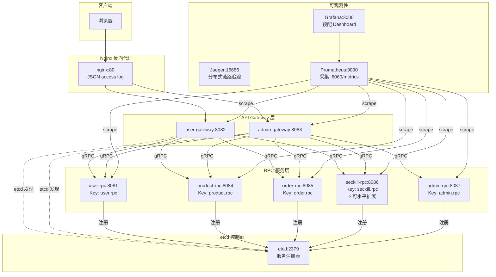

# 服务发现与集群能力架构

> 版本：v1.0 | 更新日期：2026-02-16

## 概述

FlashSale 通过 etcd 实现服务注册与发现，利用 go-zero 框架的原生支持，在单服务器 Docker Compose 部署下即可展示集群级微服务能力。

## 架构图



## 服务注册表

| 服务 | etcd Key | 监听端口 | 角色 |
|------|----------|----------|------|
| user-rpc | `user.rpc` | 8081 | 用户认证/Token |
| product-rpc | `product.rpc` | 8084 | 商品 CRUD |
| order-rpc | `order.rpc` | 8085 | 订单管理 |
| seckill-rpc | `seckill.rpc` | 8086 | 秒杀核心（可多实例） |
| admin-rpc | `admin.rpc` | 8087 | 管理员操作 |

## 工作原理

### 服务端注册

go-zero 的 `zrpc.MustNewServer()` 在检测到 yaml 中存在 `Etcd` 配置时，自动调用 `internal.NewRpcPubServer()` 将服务地址注册到 etcd，并通过 lease 机制保持心跳。

```yaml
# 示例：seckill-rpc 的注册配置
Name: seckill-rpc
ListenOn: 0.0.0.0:8086
Etcd:
  Hosts:
    - etcd:2379
  Key: seckill.rpc
```

### 客户端发现

go-zero 的 `zrpc.NewClient()` 调用 `c.BuildTarget()` 构建 gRPC target。当 yaml 配置了 `Etcd` 字段时，自动生成 `etcd://etcd:2379/seckill.rpc` 格式的 target，通过 go-zero 内置的 etcd resolver 实时监听服务实例变化。

```yaml
# 示例：user-gateway 发现 seckill-rpc
SeckillRPC:
  Etcd:
    Hosts:
      - etcd:2379
    Key: seckill.rpc
  Timeout: 8000
```

### 负载均衡

go-zero 客户端默认使用 **P2C（Power of Two Choices）** 负载均衡算法，综合考虑延迟和负载自动选择最优后端实例。支持通过 `docker compose up --scale seckill-rpc=3` 水平扩展，新实例自动被发现和纳入负载均衡。

## 配置文件体系

```
apps/<service>/etc/
├── <service>.yaml           # 本地开发（直连 127.0.0.1，无 etcd）
└── <service>.docker.yaml    # 容器化部署（etcd 注册/发现）
```

| 模式 | etcd | 服务发现方式 | 适用场景 |
|------|------|------------|----------|
| `*.yaml` | 无 | 硬编码 Target (127.0.0.1:port) | 本地 IDE 调试 |
| `*.docker.yaml` | 有 | etcd 动态发现 | Docker Compose 全容器化 |

## 可观测性集成

### Nginx JSON 结构化日志

Nginx 配置了 `json_log` 格式，输出字段：

| 字段 | 说明 |
|------|------|
| `time` | ISO 8601 时间戳 |
| `method` | HTTP 方法 |
| `uri` | 请求路径 |
| `status` | HTTP 状态码 |
| `request_time` | 总请求耗时（秒） |
| `upstream_addr` | 上游服务地址 |
| `upstream_response_time` | 上游响应耗时 |
| `request_id` | Nginx 生成的请求 ID |

### Prometheus 指标采集

go-zero DevServer 默认在 `:6060/metrics` 暴露指标，Prometheus 配置了 7 个 scrape job 对应 7 个服务。

### Grafana Dashboard

预配 `FlashSale Microservices Overview` dashboard，包含 6 个面板：

1. **RPC 请求速率** — 按服务维度展示 req/s
2. **RPC P99 延迟** — 按服务维度展示响应尾延迟
3. **Go 协程数** — 监控服务并发负载
4. **Go 堆内存使用** — 监控内存增长趋势
5. **RPC 错误率** — 按服务维度展示非 OK 比例
6. **进程 CPU 使用** — 监控计算资源消耗

### 分布式链路追踪（OpenTelemetry → Jaeger）

所有服务配置了 `Telemetry` 块，通过 OTLP gRPC 协议将 trace 数据发送到 Jaeger：

```yaml
Telemetry:
  Name: seckill.rpc
  Endpoint: jaeger:4317
  Sampler: 1.0
  Batcher: otlpgrpc
```

- **协议**：OpenTelemetry OTLP gRPC（端口 4317）
- **采样率**：1.0（全量采样，生产环境可降低）
- **可视化**：Jaeger UI 端口 16686
- **跨服务追踪**：go-zero 自动在 gRPC metadata 中传播 trace context，Gateway → RPC → RPC 的完整调用链自动关联

### DevServer 健康检查

go-zero 内置 DevServer 默认在 `:6060` 暴露：

| 端点 | 用途 |
|------|------|
| `/healthz` | 健康检查（Docker healthcheck 使用） |
| `/metrics` | Prometheus 指标 |
| `/debug/pprof/` | Go pprof 性能剖析 |

所有 7 个服务容器均配置了 `healthcheck`，Docker 可准确追踪服务健康状态。

## 从过渡方案到 etcd 的演化

| 阶段 | 方案 | 问题 |
|------|------|------|
| v1 | 硬编码 Docker service name | 无法感知实例数量变化 |
| v2 | Nginx stream LB (grpc-lb) | 额外容器/配置维护成本 |
| **v3（当前）** | **etcd + go-zero 原生发现** | ✅ 零额外组件，框架原生支持 |

## 扩缩容操作指南

```bash
# 扩展 seckill-rpc 到 3 实例
docker compose -f deploy/compose/docker-compose.app.yml up -d --scale seckill-rpc=3

# 验证 etcd 注册情况
docker exec flashsale-app-etcd etcdctl get seckill.rpc --prefix

# 缩减回 1 实例
docker compose -f deploy/compose/docker-compose.app.yml up -d --scale seckill-rpc=1
```

新实例启动后约 5 秒内即被 Gateway 发现并纳入负载均衡。
