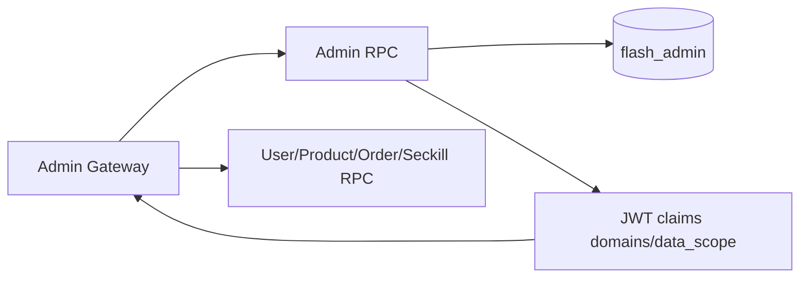

# 管理员模块（Admin RPC）

## 1. 模块职责

管理员模块负责后台身份域：管理员认证、刷新续期、管理员管理、角色管理、领域权限、审计日志。

## 2. 与其他模块关系

## 3. 代码文件职责

| 文件 | 作用 |
|---|---|
| `apps/admin/rpc/admin.go` | Admin RPC 进程入口 |
| `apps/admin/rpc/admin.proto` | 管理员 RPC 契约 |
| `apps/admin/rpc/pb/admin.pb.go` | proto 消息生成代码 |
| `apps/admin/rpc/pb/admin_grpc.pb.go` | gRPC stub 生成代码 |
| `apps/admin/rpc/adminrpc/adminrpc.go` | Admin RPC client 封装 |
| `apps/admin/rpc/etc/admin.yaml` | Admin RPC 配置 |
| `apps/admin/rpc/internal/config/config.go` | 配置结构（含 bootstrap 参数） |
| `apps/admin/rpc/internal/config/config_test.go` | 配置测试 |
| `apps/admin/rpc/internal/svc/servicecontext.go` | ServiceContext 与 bootstrap 初始化 |
| `apps/admin/rpc/internal/svc/servicecontext_bootstrap_test.go` | 超级管理员 bootstrap 幂等测试 |
| `apps/admin/rpc/internal/model/admin.go` | 管理员领域模型 |
| `apps/admin/rpc/internal/repository/repository.go` | 仓储接口定义 |
| `apps/admin/rpc/internal/repository/mysql_admin_repository.go` | MySQL 仓储实现 |
| `apps/admin/rpc/internal/logic/common.go` | 公共鉴权与校验逻辑 |
| `apps/admin/rpc/internal/logic/auth_logic.go` | 登录/刷新/退出/个人资料/改密逻辑 |
| `apps/admin/rpc/internal/logic/admin_management_logic.go` | 管理员管理逻辑 |
| `apps/admin/rpc/internal/logic/role_logic.go` | 角色与领域绑定逻辑 |
| `apps/admin/rpc/internal/logic/audit_logic.go` | 审计查询逻辑 |
| `apps/admin/rpc/internal/server/adminrpcserver.go` | gRPC server 方法装配 |
| `apps/admin/rpc/internal/server/authz.go` | RPC 鉴权辅助 |

## 4. 设计说明

- 会话模型：短期 Access Token + 可轮换 Refresh Token（落库存储哈希）。
- 权限模型：角色域集合聚合到 JWT `domains`，并携带 `data_scope`。
- 超管保护：不可删除、不可禁用、不可降权到 `self`。
- 审计覆盖：登录、管理员变更、角色变更、状态变更、密码重置等关键动作。
