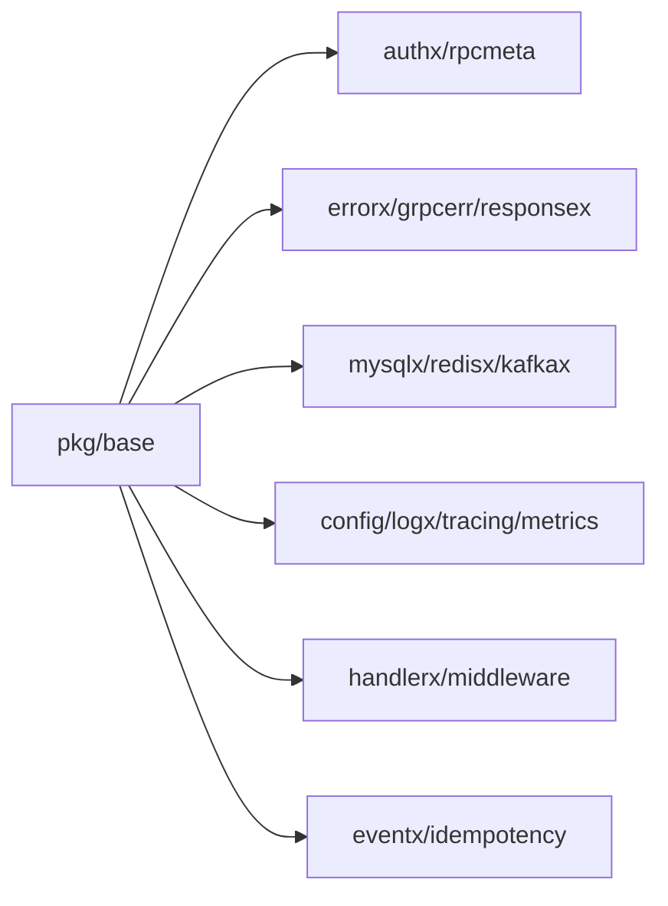

# 基础能力模块（pkg/base）

## 1. 模块职责

`pkg/base` 为所有网关与 RPC 提供统一基础能力，减少重复实现与跨模块漂移。

## 2. 能力关系图

## 3. 代码文件职责

| 文件 | 作用 |
|---|---|
| `pkg/base/config/config.go` | 基础配置结构（mysql/redis/kafka/jwt/otel） |
| `pkg/base/config/config_test.go` | 基础配置测试 |
| `pkg/base/authx/auth.go` | JWT 签发/解析能力 |
| `pkg/base/authx/auth_test.go` | JWT 能力测试 |
| `pkg/base/rpcmeta/token.go` | RPC 元数据中的 token 读写 |
| `pkg/base/errorx/error.go` | 统一业务错误码与 HTTP 状态映射 |
| `pkg/base/errorx/error_test.go` | 错误码测试 |
| `pkg/base/grpcerr/grpcerr.go` | errorx 与 gRPC status 双向映射 |
| `pkg/base/grpcerr/grpcerr_test.go` | gRPC 错误映射测试 |
| `pkg/base/responsex/response.go` | 统一响应对象构建 |
| `pkg/base/handlerx/params.go` | HTTP path/query 参数解析工具 |
| `pkg/base/handlerx/params_test.go` | 参数解析测试 |
| `pkg/base/handlerx/json_int64.go` | JSON int64 number|string 兼容解析 |
| `pkg/base/handlerx/json_int64_test.go` | JSON int64 解析测试 |
| `pkg/base/middleware/http.go` | HTTP 级通用中间件辅助 |
| `pkg/base/mysqlx/mysql.go` | MySQL 连接与默认参数封装 |
| `pkg/base/redisx/redis.go` | Redis 客户端封装 |
| `pkg/base/kafkax/kafka.go` | Kafka producer/consumer 封装 |
| `pkg/base/idempotency/idempotency.go` | 幂等记录存取能力 |
| `pkg/base/idempotency/idempotency_test.go` | 幂等能力测试 |
| `pkg/base/eventx/seckill_order_state.go` | 秒杀订单状态事件结构定义 |
| `pkg/base/logx/log.go` | 统一日志初始化 |
| `pkg/base/tracing/tracing.go` | OpenTelemetry trace 初始化 |
| `pkg/base/metrics/metrics.go` | Prometheus 指标注册与导出 |

## 4. 设计说明

- 错误、鉴权、参数解析、基础连接全部在 base 统一，业务模块只做领域逻辑。
- base 包中的测试文件是“跨模块稳定性门禁”，变更必须优先回归这些基础测试。
