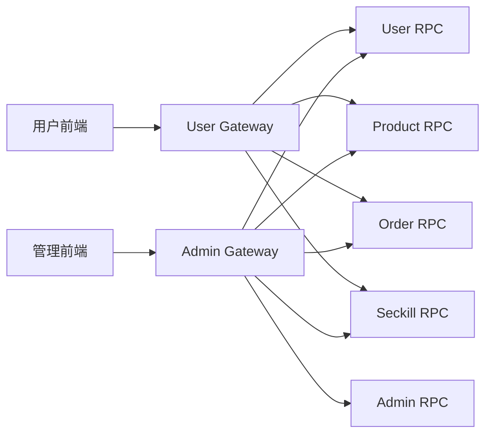

# Gateway 模块

## 1. 模块职责

Gateway 是 HTTP 边界层，负责：

- 路由注册与协议转换（HTTP JSON -> gRPC）
- 鉴权与领域权限校验（admin）
- 统一响应格式与错误映射
- 用户侧限流（登录、注册、秒杀购买、秒杀埋点）
- 请求参数前置校验与 int64 兼容解析

## 2. 与其他模块关系

## 3. 代码文件职责

| 文件 | 作用 |
|---|---|
| `apps/gateway/user/main.go` | 用户网关启动入口 |
| `apps/gateway/user/etc/user-gateway.yaml` | 用户网关监听与各 RPC Target |
| `apps/gateway/user/internal/config/config.go` | 用户网关配置结构定义 |
| `apps/gateway/user/internal/config/config_test.go` | 配置装载测试 |
| `apps/gateway/user/internal/svc/servicecontext.go` | 用户网关 RPC client 初始化 |
| `apps/gateway/user/internal/middleware/auth.go` | 用户 JWT 鉴权中间件 |
| `apps/gateway/user/internal/middleware/auth_test.go` | 用户鉴权中间件测试 |
| `apps/gateway/user/internal/middleware/rate_limit.go` | 注册/登录/秒杀限流中间件 |
| `apps/gateway/user/internal/middleware/rate_limit_test.go` | 限流中间件测试 |
| `apps/gateway/user/internal/middleware/response.go` | 统一 HTTP 响应输出 |
| `apps/gateway/user/internal/handler/handler.go` | 用户基础接口（注册/登录/资料）与路由主装配 |
| `apps/gateway/user/internal/handler/handler_decodejson_test.go` | JSON 解码边界测试 |
| `apps/gateway/user/internal/handler/product_handler.go` | 用户商品列表/详情 HTTP 处理 |
| `apps/gateway/user/internal/handler/product_handler_test.go` | 用户商品 handler 测试 |
| `apps/gateway/user/internal/handler/order_handler.go` | 用户订单创建/支付确认/取消/收货/查询 |
| `apps/gateway/user/internal/handler/seckill_handler.go` | 用户秒杀活动/抢购/埋点接口 |
| `apps/gateway/admin/main.go` | 管理网关启动入口 |
| `apps/gateway/admin/etc/admin-gateway.yaml` | 管理网关监听与各 RPC Target |
| `apps/gateway/admin/internal/config/config.go` | 管理网关配置结构定义 |
| `apps/gateway/admin/internal/config/config_test.go` | 管理配置装载测试 |
| `apps/gateway/admin/internal/svc/servicecontext.go` | 管理网关 RPC client 初始化 |
| `apps/gateway/admin/internal/authz/authorizer.go` | 领域权限常量与授权器（含 `order_review_management`） |
| `apps/gateway/admin/internal/middleware/auth.go` | 管理 JWT 鉴权中间件 |
| `apps/gateway/admin/internal/middleware/auth_test.go` | 管理鉴权中间件测试 |
| `apps/gateway/admin/internal/middleware/response.go` | 统一响应输出 |
| `apps/gateway/admin/internal/handler/handler.go` | 管理端主路由装配 + 用户管理基础 handler |
| `apps/gateway/admin/internal/handler/handler_decodejson_test.go` | JSON 解码边界测试 |
| `apps/gateway/admin/internal/handler/types.go` | 管理端请求体复用类型定义 |
| `apps/gateway/admin/internal/handler/admin_module_handler.go` | 管理员模块（登录/刷新/管理员/角色/审计）接口 |
| `apps/gateway/admin/internal/handler/product_handler.go` | 商品管理 CRUD 接口 |
| `apps/gateway/admin/internal/handler/product_handler_test.go` | 商品管理 handler 测试 |
| `apps/gateway/admin/internal/handler/order_handler.go` | 订单审核/发货/查询接口 |
| `apps/gateway/admin/internal/handler/seckill_handler.go` | 秒杀活动管理、流量、活动订单追溯接口 |

## 4. 网关设计要点

- 用户网关公共查询（商品、秒杀活动）允许匿名；交易写接口必须鉴权。
- 管理网关采用 `AuthRequired + RequireDomain` 双中间件。
- 审核与发货权限已拆分：审核支持 `order_review_management`，发货要求 `order_management`。
- 对雪花 ID 入参采用 `pkg/base/handlerx` 的 int64 安全兼容解析。
