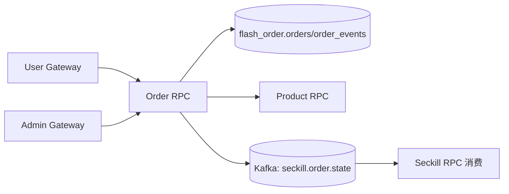
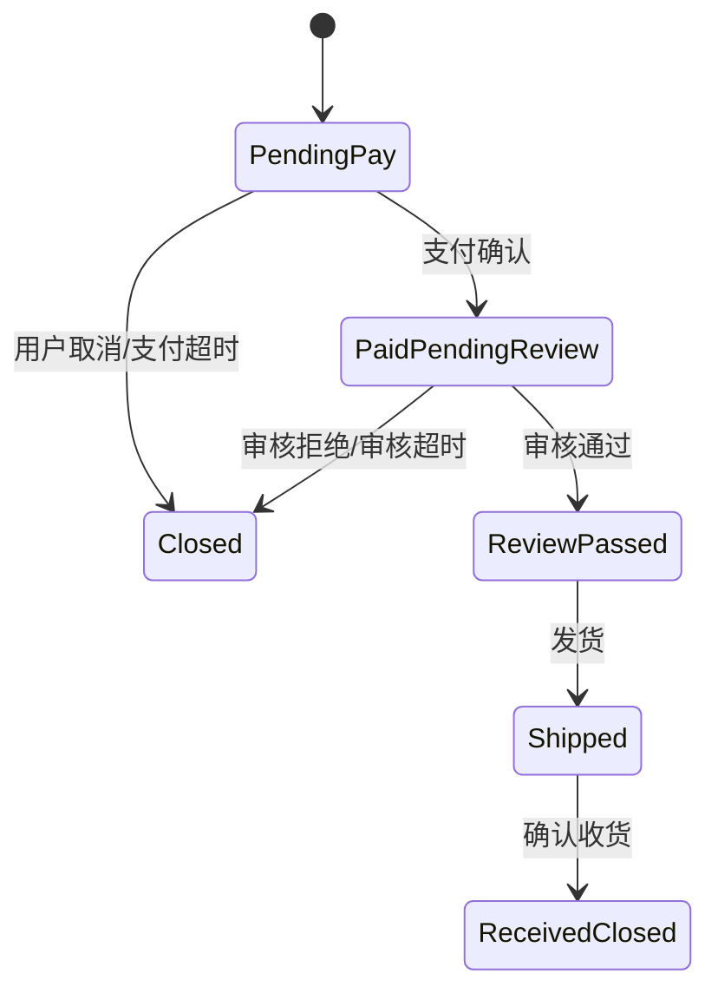

# 订单模块（Order RPC）

## 1. 模块职责

订单模块承载完整交易链路：创建订单、支付确认、系统审核、发货、确认收货、取消/关闭，并向秒杀模块回流状态事件。

## 2. 与其他模块关系

## 3. 代码文件职责

| 文件 | 作用 |
|---|---|
| `apps/order/rpc/order.go` | Order RPC 入口 |
| `apps/order/rpc/order.proto` | 订单 RPC 契约（含秒杀建单） |
| `apps/order/rpc/pb/order.pb.go` | proto 消息生成代码 |
| `apps/order/rpc/pb/order_grpc.pb.go` | gRPC stub 生成代码 |
| `apps/order/rpc/orderrpc/orderrpc.go` | Order RPC client 封装 |
| `apps/order/rpc/etc/order.yaml` | Order RPC 配置 |
| `apps/order/rpc/internal/config/config.go` | 配置结构（并发门限、事件配置） |
| `apps/order/rpc/internal/config/config_test.go` | 配置测试 |
| `apps/order/rpc/internal/svc/servicecontext.go` | ServiceContext（DB/RPC/Kafka 等依赖） |
| `apps/order/rpc/internal/model/order.go` | 订单领域模型 |
| `apps/order/rpc/internal/repository/order_repository.go` | 仓储接口 |
| `apps/order/rpc/internal/repository/mysql_order_repository.go` | MySQL 仓储实现 |
| `apps/order/rpc/internal/repository/mysql_order_repository_integration_test.go` | 仓储集成测试 |
| `apps/order/rpc/internal/repository/mysql_order_repository_sql_test.go` | SQL 行为测试 |
| `apps/order/rpc/internal/logic/common.go` | 公共逻辑与状态判断 |
| `apps/order/rpc/internal/logic/stock_helper.go` | 库存辅助调用封装 |
| `apps/order/rpc/internal/logic/create_order_logic.go` | 普通订单创建逻辑 |
| `apps/order/rpc/internal/logic/create_order_from_seckill_logic.go` | 秒杀订单创建逻辑 |
| `apps/order/rpc/internal/logic/confirm_payment_and_info_logic.go` | 支付确认与收货信息确认 |
| `apps/order/rpc/internal/logic/review_order_admin_logic.go` | 管理端审核逻辑 |
| `apps/order/rpc/internal/logic/ship_order_admin_logic.go` | 管理端发货逻辑 |
| `apps/order/rpc/internal/logic/confirm_receipt_logic.go` | 用户确认收货逻辑 |
| `apps/order/rpc/internal/logic/cancel_order_logic.go` | 订单取消逻辑 |
| `apps/order/rpc/internal/logic/timeout_job_logic.go` | 超时关闭/补偿作业逻辑 |
| `apps/order/rpc/internal/logic/get_list_user_logic.go` | 用户端订单详情/列表 |
| `apps/order/rpc/internal/logic/get_list_admin_logic.go` | 管理端订单详情/列表 |
| `apps/order/rpc/internal/logic/seckill_order_event.go` | 秒杀订单状态事件发布 |
| `apps/order/rpc/internal/logic/order_logic_test.go` | 核心逻辑测试 |
| `apps/order/rpc/internal/server/orderrpcserver.go` | gRPC server 方法装配 |
| `apps/order/rpc/internal/server/authz.go` | RPC 鉴权辅助 |
| `apps/order/rpc/internal/server/authz_test.go` | 鉴权测试 |

## 4. 交易状态链路

## 5. 设计说明

- 订单主流程与秒杀订单统一在同一生命周期模型中管理。
- 审核域权限与发货域权限已在网关拆分控制。
- 秒杀来源订单会附带 `seckill_activity_id/seckill_activity_item_id` 以支持追溯。
