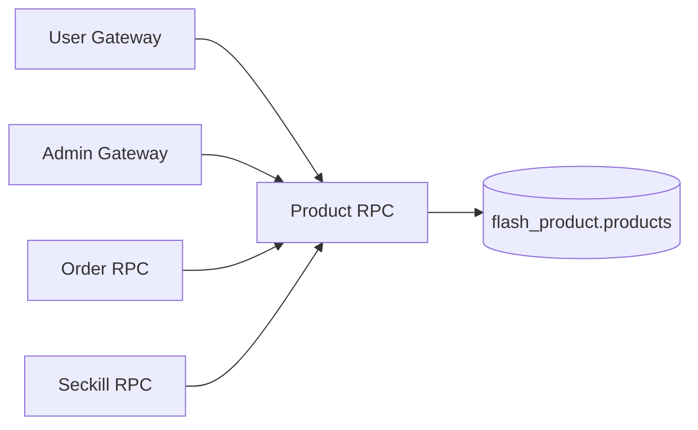

# 商品模块（Product RPC）

## 1. 模块职责

商品模块提供：管理端商品 CRUD、用户端商品浏览、订单/秒杀库存预占与释放接口。

## 2. 与其他模块关系

## 3. 代码文件职责

| 文件 | 作用 |
|---|---|
| `apps/product/rpc/product.go` | Product RPC 入口 |
| `apps/product/rpc/product.proto` | 商品 RPC 契约（含库存接口） |
| `apps/product/rpc/pb/product.pb.go` | proto 消息生成代码 |
| `apps/product/rpc/pb/product_grpc.pb.go` | gRPC stub 生成代码 |
| `apps/product/rpc/productrpc/productrpc.go` | Product RPC client 封装 |
| `apps/product/rpc/etc/product.yaml` | Product RPC 配置 |
| `apps/product/rpc/internal/config/config.go` | 配置结构 |
| `apps/product/rpc/internal/config/config_test.go` | 配置测试 |
| `apps/product/rpc/internal/svc/servicecontext.go` | ServiceContext 依赖装配 |
| `apps/product/rpc/internal/model/product.go` | 商品领域模型 |
| `apps/product/rpc/internal/repository/product_repository.go` | 仓储接口 |
| `apps/product/rpc/internal/repository/mysql_product_repository.go` | MySQL 仓储实现 |
| `apps/product/rpc/internal/repository/mysql_product_repository_integration_test.go` | 仓储集成测试 |
| `apps/product/rpc/internal/repository/mysql_product_repository_unit_test.go` | 仓储单元测试 |
| `apps/product/rpc/internal/logic/common.go` | 公共逻辑与校验 |
| `apps/product/rpc/internal/logic/create_product_logic.go` | 管理端创建商品 |
| `apps/product/rpc/internal/logic/update_product_logic.go` | 管理端更新商品 |
| `apps/product/rpc/internal/logic/delete_product_logic.go` | 管理端软删除商品 |
| `apps/product/rpc/internal/logic/get_list_admin_logic.go` | 管理端详情/列表 |
| `apps/product/rpc/internal/logic/get_list_public_logic.go` | 用户端详情/列表（仅上架且未删除） |
| `apps/product/rpc/internal/logic/stock_order_logic.go` | 库存预占/释放（订单与活动） |
| `apps/product/rpc/internal/logic/product_logic_test.go` | 核心商品逻辑测试 |
| `apps/product/rpc/internal/logic/validation_test.go` | 参数校验测试 |
| `apps/product/rpc/internal/server/productrpcserver.go` | gRPC server 方法装配 |
| `apps/product/rpc/internal/server/authz.go` | RPC 鉴权辅助 |
| `apps/product/rpc/internal/server/authz_test.go` | 鉴权测试 |

## 4. 设计说明

- 单 SKU 模型，`price_cent` 使用 `int64` 分。
- 商品删除为软删除（`deleted_at`）。
- 用户端不暴露库存数值，仅暴露 `in_stock` 语义。
- 秒杀发布/下线通过活动维度库存接口做预占与释放。
