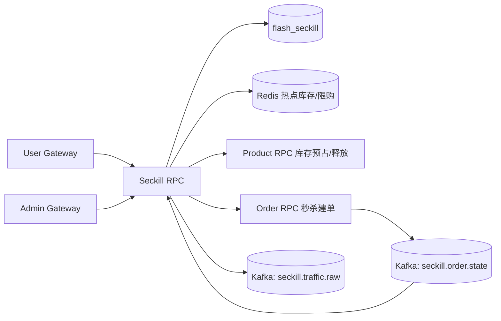
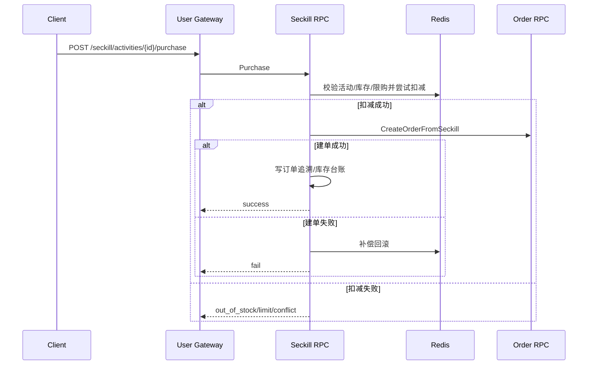

# 秒杀模块（Seckill RPC）

## 1. 模块职责

秒杀模块以“活动”为核心，提供活动管理、活动商品管理、发布下线、抢购、埋点、活动订单追溯与流量聚合。

## 2. 与其他模块关系

## 3. 代码文件职责

| 文件 | 作用 |
|---|---|
| `apps/seckill/rpc/seckill.go` | Seckill RPC 入口 |
| `apps/seckill/rpc/seckill.proto` | 秒杀 RPC 契约 |
| `apps/seckill/rpc/pb/seckill.pb.go` | proto 消息生成代码 |
| `apps/seckill/rpc/pb/seckill_grpc.pb.go` | gRPC stub 生成代码 |
| `apps/seckill/rpc/seckillrpc/seckillrpc.go` | Seckill RPC client 封装 |
| `apps/seckill/rpc/etc/seckill.yaml` | Seckill RPC 配置（缓存、并发、异步队列参数） |
| `apps/seckill/rpc/internal/config/config.go` | 配置结构 |
| `apps/seckill/rpc/internal/config/config_test.go` | 配置测试 |
| `apps/seckill/rpc/internal/svc/servicecontext.go` | ServiceContext 依赖装配 |
| `apps/seckill/rpc/internal/svc/activity_item_cache.go` | 活动商品缓存实现 |
| `apps/seckill/rpc/internal/svc/activity_item_cache_test.go` | 活动商品缓存测试 |
| `apps/seckill/rpc/internal/svc/perfstats.go` | 性能统计输出 |
| `apps/seckill/rpc/internal/model/seckill.go` | 秒杀领域模型 |
| `apps/seckill/rpc/internal/repository/repository.go` | 仓储接口定义 |
| `apps/seckill/rpc/internal/repository/mysql_seckill_repository.go` | MySQL 仓储实现 |
| `apps/seckill/rpc/internal/repository/traffic_agg_test.go` | 流量聚合仓储测试 |
| `apps/seckill/rpc/internal/logic/common.go` | 公共逻辑、校验、工具函数 |
| `apps/seckill/rpc/internal/logic/common_test.go` | 公共逻辑测试 |
| `apps/seckill/rpc/internal/logic/activity_logic.go` | 活动/活动商品管理、发布下线、流量与订单查询 |
| `apps/seckill/rpc/internal/logic/purchase_logic.go` | 抢购主流程逻辑（扣减、建单、补偿） |
| `apps/seckill/rpc/internal/logic/purchase_logic_test.go` | 抢购逻辑测试 |
| `apps/seckill/rpc/internal/logic/purchase_cache.go` | 抢购缓存与限购辅助 |
| `apps/seckill/rpc/internal/logic/purchase_cache_test.go` | 抢购缓存测试 |
| `apps/seckill/rpc/internal/logic/purchase_cache_benchmark_test.go` | 抢购缓存基准测试 |
| `apps/seckill/rpc/internal/logic/order_state_consumer.go` | 订单状态回流消费与活动订单同步 |
| `apps/seckill/rpc/internal/logic/order_state_consumer_test.go` | 回流消费者测试 |
| `apps/seckill/rpc/internal/server/seckillrpcserver.go` | gRPC server 方法装配 |
| `apps/seckill/rpc/internal/server/authz.go` | RPC 鉴权辅助 |

## 4. 抢购流程图

## 5. 设计说明

- 活动发布阶段执行商品库存预占，结束/下线时释放剩余预占。
- 运行时采用最终一致：热点判定优先 Redis，追溯与对账落 MySQL/Kafka。
- 活动可重叠，同商品活动抢购请求必须携带 `activity_item_id`。
