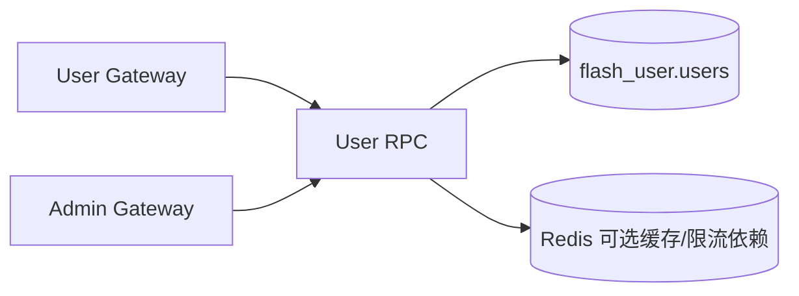

# 用户模块（User RPC）

## 1. 模块职责

用户模块负责 C 端账号域能力：注册、登录、资料获取、昵称修改、账号注销。

## 2. 与其他模块关系

## 3. 代码文件职责

| 文件 | 作用 |
|---|---|
| `apps/user/rpc/user.go` | User RPC 进程入口 |
| `apps/user/rpc/user.proto` | 用户 RPC 契约定义 |
| `apps/user/rpc/pb/user.pb.go` | proto 消息体生成代码 |
| `apps/user/rpc/pb/user_grpc.pb.go` | gRPC stub 生成代码 |
| `apps/user/rpc/userrpc/userrpc.go` | User RPC client 封装 |
| `apps/user/rpc/etc/user.yaml` | User RPC 配置（端口、base config、雪花节点） |
| `apps/user/rpc/internal/config/config.go` | User RPC 配置结构 |
| `apps/user/rpc/internal/config/config_test.go` | 配置测试 |
| `apps/user/rpc/internal/svc/servicecontext.go` | ServiceContext：DB/JWT/日志/雪花等依赖装配 |
| `apps/user/rpc/internal/model/user.go` | 用户领域模型定义 |
| `apps/user/rpc/internal/repository/user_repository.go` | 仓储接口定义 |
| `apps/user/rpc/internal/repository/mysql_user_repository.go` | MySQL 仓储实现 |
| `apps/user/rpc/internal/repository/mysql_user_repository_integration_test.go` | 仓储集成测试 |
| `apps/user/rpc/internal/logic/common.go` | 公共逻辑与校验复用 |
| `apps/user/rpc/internal/logic/register_logic.go` | 注册逻辑 |
| `apps/user/rpc/internal/logic/login_logic.go` | 登录逻辑 |
| `apps/user/rpc/internal/logic/get_profile_logic.go` | 获取资料逻辑 |
| `apps/user/rpc/internal/logic/update_nickname_logic.go` | 修改昵称逻辑 |
| `apps/user/rpc/internal/logic/delete_user_logic.go` | 注销/删除逻辑 |
| `apps/user/rpc/internal/logic/auth_logic_test.go` | 注册/登录逻辑测试 |
| `apps/user/rpc/internal/logic/validation_test.go` | 参数校验测试 |
| `apps/user/rpc/internal/server/userrpcserver.go` | gRPC server 方法装配 |
| `apps/user/rpc/internal/server/authz.go` | RPC 层鉴权辅助 |
| `apps/user/rpc/internal/server/authz_test.go` | 鉴权辅助测试 |

## 4. 设计说明

- 用户口令策略复用于系统统一规则（强度校验 + bcrypt）。
- 管理端查询用户信息通过网关进入同一 User RPC，无单独“管理用户表”。
- 返回的用户 ID 为雪花 ID，前端按字符串处理以避免 JS 精度丢失。
