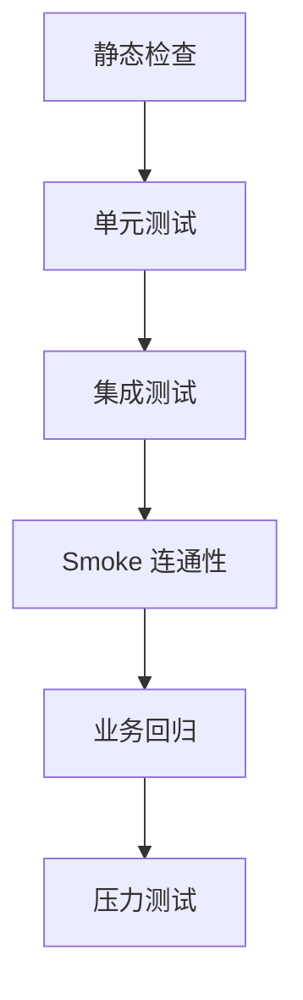

# 测试方法与测试依据

## 1. 测试分层

## 2. 测试方法

| 层级 | 目标 | 主要命令 |
|---|---|---|
| 静态检查 | 发现明显代码问题 | `go vet ./...` |
| 单元测试 | 逻辑与工具函数正确性 | `go test ./... -short` |
| 仓储集成测试 | SQL 与索引行为正确性 | `go test ./apps/*/rpc/internal/repository/...` |
| Smoke | 中间件连通性验证 | `go run ./cmd/fs env smoke` |
| 前端构建与测试 | API 契约与 hooks 行为 | `bun run lint && bun run test:run && bun run build` |
| 压力测试 | 秒杀链路吞吐、失败率、幂等与退化 | `go run ./cmd/fs perf <scenario>` |

## 3. 秒杀专项测试依据

### 3.1 功能正确性依据

- **无超卖**：高并发下成功订单数不超过可售库存。
- **幂等正确**：同 `idempotency_key` 场景下 `unique_orders <= 1`。
- **失败可补偿**：建单失败后库存与限购计数回滚。
- **活动可追溯**：可按活动查询关联订单与状态变化。

### 3.2 压测方法依据

- **闭环模型**：固定请求总数 + 并发数，观察系统完成端到端处理能力。
- **开环模型**：固定到达率（RPS）+ 持续时长，观察峰值冲击下退化行为。
- **结果断言**：通过 `expect-max-success`、`max-network-errors` 等门禁参数自动判定。

## 4. 压测场景说明

| 场景 | 说明 | 常见用途 |
|---|---|---|
| `purchase-stress` | 秒杀购买闭环压测 | 常规吞吐评估 |
| `idempotency` | 同幂等键重复请求压测 | 幂等正确性验证 |
| `track-stress` | 埋点闭环压测 | 埋点写入吞吐与接受率 |
| `purchase-open` | 秒杀购买开环压测 | 峰值冲击与退化分析 |
| `track-open` | 埋点开环压测 | 高频事件流量稳定性 |

## 5. 测试结果沉淀建议

- 将压测输出统一使用 `-output json`，并落地到 `.memory/runlogs`。
- 每次优化后保留“基线 vs 新结果”的关键指标对比：
  - `rps`
  - `latency_p95_ms`
  - `network_errors`
  - `business_code` 分布
- 回归报告建议与 commit 对齐，便于回溯“哪次优化带来哪项指标变化”。
