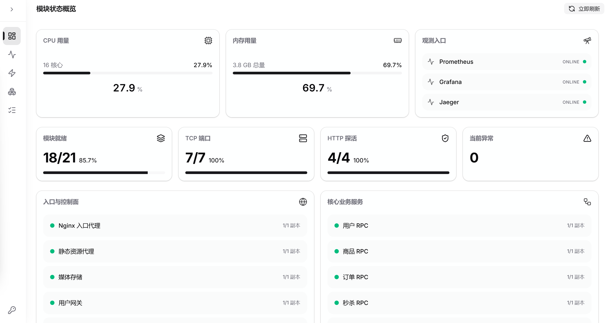
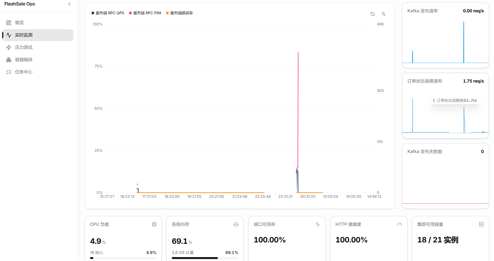
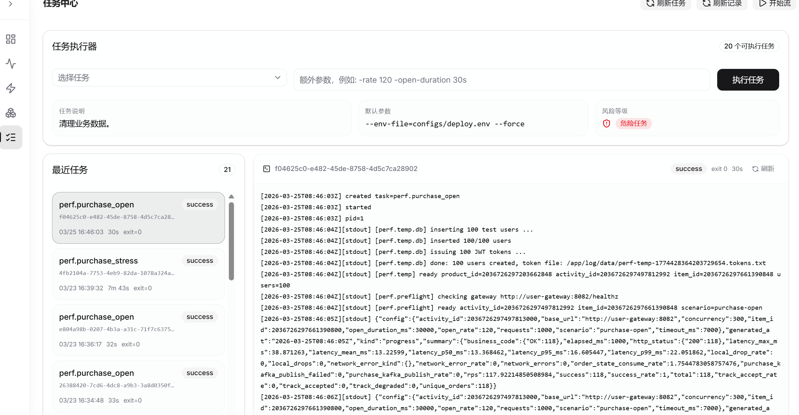
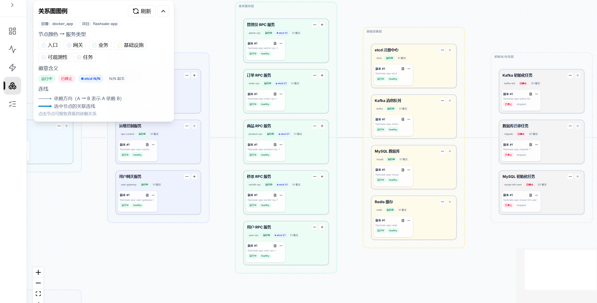
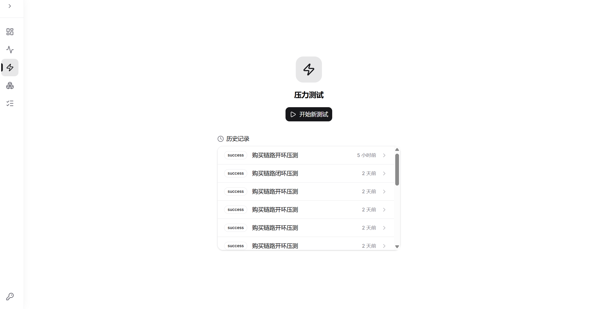
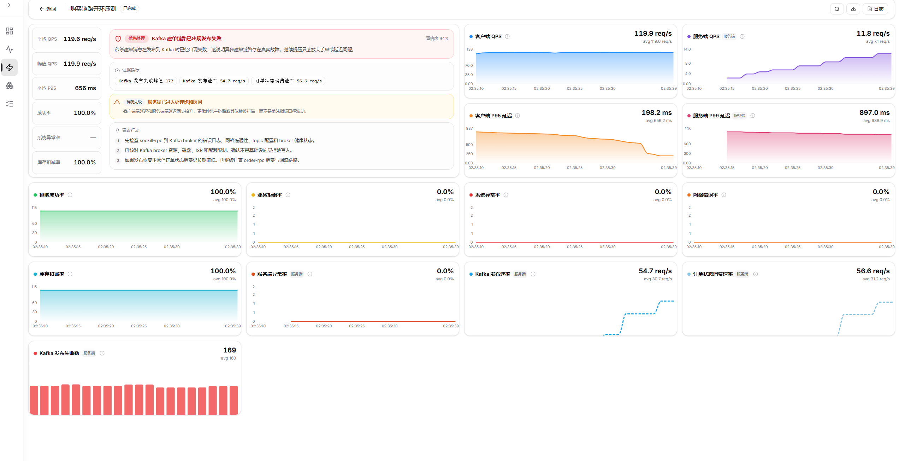

# Ops 控制台界面导览

`ops-control` 是 FlashSale 专用的运维控制台，提供实时状态监测、任务调度、性能测试和容器资源聚合等能力，部署后通过 `:9100` 端口访问。

---

## 1. 模块状态概览

系统启动后的首页，展示各 RPC 服务和基础设施组件的健康状态摘要，是判断当前系统整体是否就绪的起点。

---

## 2. 实时监测

实时展示核心业务指标：QPS、P99 延迟、错误率等，数据以持久化 + 降采样方式渲染，避免历史数据与实时数据混淆。

> 该页面已完成"持久数据优先"架构重构，降采样与 P99 噪声屏蔽均由后端完成。

---

## 3. 任务执行

展示当前运行中的后台任务（如订单补偿、库存同步、消费者组重置等），支持查看任务进度和日志输出。

---

## 4. 容器信息

聚合 Docker Compose 各容器的运行状态、端口映射和资源占用情况，方便在不登录服务器的情况下快速定位容器异常。

---

## 5. 性能测试

内置的开环压测入口，用于在受控场景下验证秒杀链路吞吐量，替代了原有 k6 脚本。分为两个子页面：

### 测试配置与触发

配置并发数、请求数、目标接口，一键发起压测任务。

### 压测结果概览

展示压测完成后的 QPS、成功率、P99 等汇总指标。

---

## 6. 访问地址

| 端 | 域名 |
|----|------|
| 用户端 | https://flashsale-user.fenmeihui.cloud |
| 管理端 | https://flashsale-admin.fenmeihui.cloud |
| 本地 Ops 控制台 | `http://localhost:9100` |

控制台由 `ops-control` 容器提供服务，路由和鉴权逻辑见 `ops/backend/`，前端源码见 `frontend/ops/`。
